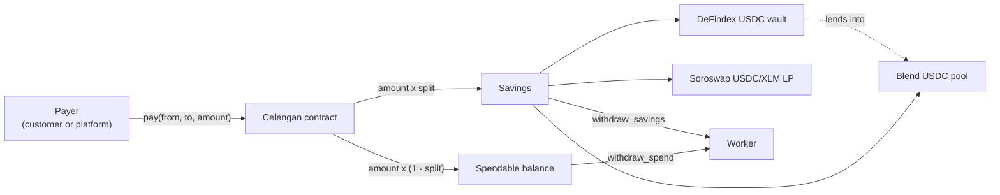

<div align="center">
  
  <h1>Celengan</h1>
  <p>Programmable savings on every payment, on Stellar.</p>

  
  
  
</div>

---

Celengan (Indonesian for piggy bank) is a payment splitter for gig workers
and small merchants: every incoming USDC payment is automatically split
between a spendable balance and a yield-earning savings position, with an
optional time lock for goals and emergency funds. Workers in Indonesia and
across Southeast Asia rarely have an employer pension or automatic savings;
Celengan makes saving the default instead of an afterthought.

## How it works



The recipient sets their own savings rule (default 20%) and picks where it
earns yield: the DeFindex USDC vault, lending directly on Blend, or
providing USDC/XLM liquidity on Soroswap. The savings share moves into that
protocol in the same transaction, so the worker holds a yield-bearing
position, not idle balance. Switching yield source is only allowed at a
zero savings balance, since the protocols' share units are not
interchangeable. Savings can be locked until a chosen date; locks can only
be extended, never shortened.

## Deployed contracts (testnet)

| Contract | Address |
| --- | --- |
| Celengan | `CCCIVH3WBPYE6X4XR3Y7TLPRN44XU5Q4BUSD6RT7DWXWEOFLXDC3DFMV` |
| DeFindex USDC vault | `CBMVK2JK6NTOT2O4HNQAIQFJY232BHKGLIMXDVQVHIIZKDACXDFZDWHN` |
| Blend USDC pool | `CCEBVDYM32YNYCVNRXQKDFFPISJJCV557CDZEIRBEE4NCV4KHPQ44HGF` |
| Soroswap router | `CCJUD55AG6W5HAI5LRVNKAE5WDP5XGZBUDS5WNTIVDU7O264UZZE7BRD` |
| Soroswap USDC/XLM pair | `CBR76WMT6J733CCVBP23M2EL5QGP5HXLPEFNFZGZ7IB6QHOJAHP7YM3V` |
| USDC (Blend testnet SAC) | `CAQCFVLOBK5GIULPNZRGATJJMIZL5BSP7X5YJVMGCPTUEPFM4AVSRCJU` |

The testnet USDC above is Blend's own classic asset, not Circle's testnet
USDC: the DeFindex vault and Blend pool are both configured against this
specific issuer, so a wallet needs its trustline (not Circle's) to hold or
receive it. The app's own faucet button sets this up automatically.

## Repository layout

- `contracts/` - Soroban contract (Rust, soroban-sdk 26, OpenZeppelin
  stellar-access and stellar-contract-utils)
- `web/` - frontend (Vite, React, TypeScript, Tailwind CSS v4, shadcn/ui,
  Stellar Wallets Kit)
- `packages/celengan` - TypeScript bindings generated from the deployed
  contract
- `scripts/` - deploy and end-to-end verification scripts

## Running locally

Frontend (defaults to the live testnet deployment):

```bash
cd web
pnpm install
pnpm dev
```

Contract tests:

```bash
cd contracts
cargo test
```

End-to-end check on testnet (faucet -> pay -> split -> vault -> withdraw):

```bash
./scripts/e2e.sh CCCIVH3WBPYE6X4XR3Y7TLPRN44XU5Q4BUSD6RT7DWXWEOFLXDC3DFMV
```

## Trying the app

1. Install a Stellar wallet (Freighter works well) and switch it to testnet.
2. Connect the wallet on the dashboard.
3. Use "Get test USDC" to fund the wallet (XLM via friendbot plus 1,000
   testnet USDC via the Blend faucet, trustline included).
4. Simulate an incoming payment and watch it split between spendable and
   savings, then try both withdrawals, the savings rule slider, and the lock.
5. On the Rules page, switch the savings destination between DeFindex, Blend,
   and Soroswap once the balance is at zero, and watch the yield position
   track whichever protocol is active.
6. Share your payment link (`/pay/<address>?name=...&amount=...`, with a QR
   code) and pay it from a second wallet: the payer signs, the recipient's
   split rule routes part of the payment straight into their chosen yield
   source.

The app ships in English, Indonesian, Vietnamese, and Filipino, with a
settings dialog for language and primary display currency (USDC, IDR, VND,
PHP). Activity history is reconstructed from on-chain contract events, so it
survives refreshes and device switches, and every action shows the resulting
transaction hash with a link to the explorer.

## Design notes

- The contract pre-authorizes a vault, pool, or router's nested token pull
  with `authorize_as_current_contract`, since invoker auth does not reach
  sub-invocations; this is what lets the contract deposit on its own behalf.
- Withdrawals are not pausable. Pause stops inflows only, so the owner can
  never freeze user exits.
- If the chosen yield source is unavailable, `pay` degrades gracefully: the
  savings share is credited as spendable instead of failing the payment.
- Savings payouts are measured as balance or position deltas rather than
  trusting a vault or pool's reported amount, keeping pooled spendable funds
  untouchable and one user's withdrawal unable to reach into another's
  share of a shared position.
- Blend share accounting floors on deposit and floors on withdrawal
  conversion, which provably keeps the redeemable amount at or below the
  user's own share balance even as Blend's internal rate accrues.
- Soroswap turns single-asset USDC into a two-sided LP position with two
  calls (swap half to XLM, then add both as liquidity), unlike Blend or
  DeFindex's single-call deposit. Every router call's slippage minimum is
  computed on chain from a live quote, never left at zero, and if liquidity
  can't be added after the swap already landed XLM, the XLM is swapped
  straight back to USDC so the payment still degrades to an accurate
  spendable credit instead of stranding it. Withdrawals go the other way
  (remove liquidity, then swap the XLM leg back) as a single atomic call:
  any failure reverts the whole withdrawal rather than risking a partial one.
- Locks are capped at five years to keep a typo from freezing funds forever.

## Roadmap

- Username registry so payment links read `/pay/budi` instead of an address
- IDR display via an on-chain FX oracle once IDR feeds are available
  (Reflector's testnet FX feed does not serve IDR yet)
- Anchor cash-out integration (SEP-31 style corridors like PeraHub in the
  Philippines) for a full earn -> save -> cash-out loop
- Mainnet deployment against DeFindex, Blend, and Soroswap's mainnet USDC
  markets
